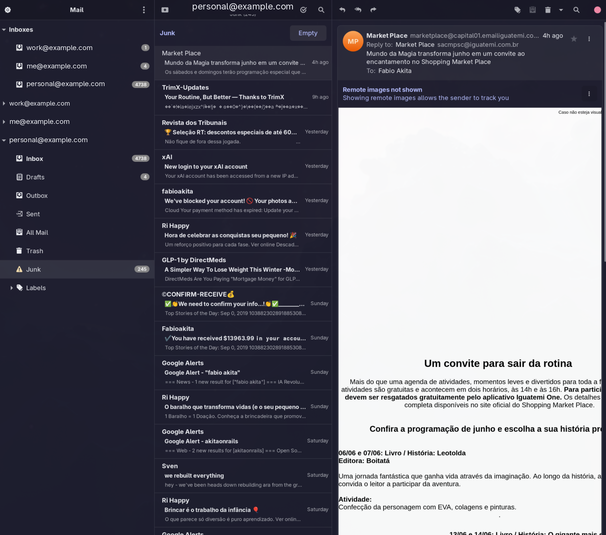
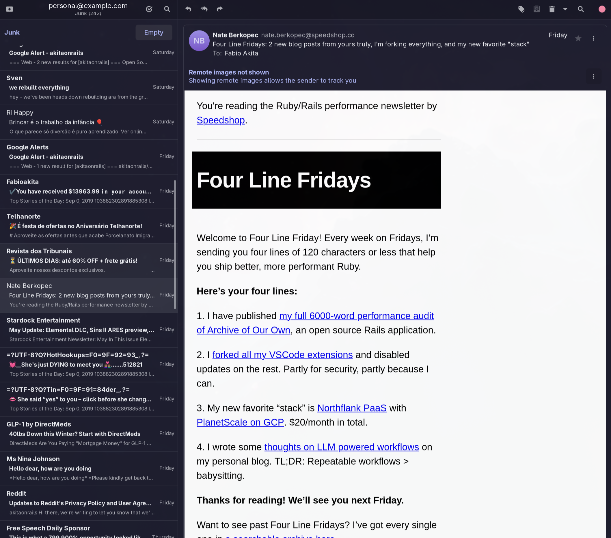

# geary-hide-sidebar

A tiny **GTK3 module** that collapses/expands Geary's left **"Mail"
sidebar** (the account/folder-list column) at runtime — **without forking
or rebuilding Geary**, and without touching any file under `/usr`.

- **Keybinding** to toggle the sidebar (default **Ctrl+Shift+M**).
- **Auto mode**: collapses by default when the window is **narrow** or on a
  **portrait (vertical) monitor**; expands when wide on a landscape
  monitor. Re-evaluated whenever you resize or drag between monitors.

## Screenshots

<table>
<tr>
<td width="50%" align="center">

**Default Geary** — the left "Mail" column (account/folder list) takes up a
big slice of a narrow window.



</td>
<td width="50%" align="center">

**With the module** — the sidebar is collapsed, handing all the width to the
message list and reading pane. Toggle back any time with **Ctrl+Shift+M**.



</td>
</tr>
</table>

> Email addresses in the screenshots are placeholders.

Written against Geary `1:46.0` (Arch package), which links the system
GTK3 + libhandy-1.

## Install on Arch (AUR)

```sh
yay -S geary-hide-sidebar       # builds from source (x86_64 + aarch64)
yay -S geary-hide-sidebar-bin   # prebuilt .so (x86_64 only)
```

Either package works the same once installed; pick `-bin` to skip the
(sub-second) compile, or the source package on aarch64. They `provides`/
`conflicts` each other, so pacman swaps cleanly between them. The package
depends on `geary` and installs to `/usr/lib/geary-hide-sidebar/`. Its install scriptlet patches **both**
Geary launch paths to load the module via `GTK_MODULES`:

- the desktop entry `/usr/share/applications/org.gnome.Geary.desktop`, and
- the D-Bus activation service `/usr/share/dbus-1/services/org.gnome.Geary.service`
  — required because Geary is `DBusActivatable`, so GNOME often starts it
  through D-Bus rather than the desktop `Exec=` line.

A bundled pacman hook re-applies the patch after any future `geary` upgrade
(which would otherwise restore the pristine launchers). Removing the package
strips the injection back out, restoring Geary's launchers **byte-for-byte**:

```sh
yay -R geary-hide-sidebar      # Geary keeps working, unpatched
```

Restart any running Geary instance after install/removal. Tune behavior by
editing the `GEARY_HIDE_SIDEBAR_*` env vars in the patched `Exec=` lines (see
*Configuration* below).

> Unlike the manual setup below (which touches nothing under `/usr`), the AUR
> package edits Geary's system launcher files in place. The edit is idempotent
> and exactly reversible, so uninstalling leaves Geary as it was.

## Why a GTK module instead of a Geary plugin?

Geary's plugin API never exposes the main-window layout. The only
extension point that can reach those widgets (`TrustedExtension`) is
refused for any plugin not installed in Geary's *system* plugins
directory, and Geary scans no user plugin directory at all. So a normal
plugin physically cannot touch the sidebar.

A GTK module sidesteps that: GTK loads any library named in the
`GTK_MODULES` environment variable and calls its `gtk_module_init()` right
after GTK starts — so we run *inside Geary's process* and manipulate the
live widget tree directly.

### Why not just send a PR upstream?

We deliberately didn't open a pull request for this. The ability to
hide/collapse the folder-list column has been requested upstream several
times over the years, and those issues have gone unaddressed — which reads
less like a backlog and more like a deliberate design stance that this
isn't a direction the maintainers want Geary to take. Rather than push a
change they've effectively already declined, this module gives the same
result entirely on the user's side, without forking or modifying Geary.

## How it works

1. On load we install an emission hook on `GtkWidget::map` and a global
   GTK key snooper.
2. When a window of GType `ApplicationMainWindow` (Geary's main window, per
   `<template class="ApplicationMainWindow">` in
   `ui/application-main-window.ui`) is mapped, we locate the "Mail" column
   **by structure**, not by name. Geary's main window is a composite
   template, so GtkBuilder does *not* copy object ids into widget names;
   instead we anchor on a CSS style class that the `.ui` reliably applies:
   - find the widget with style class `geary-folder` (the folder-list
     scrolled window),
   - its parent is the "Mail" column box we hide,
   - and that box's sibling separator (a `GtkSeparator`) is hidden too.
3. To collapse we set the box invisible *and* `child-visible` false (an
   unfolded `HdyLeaflet` tracks the two separately), mark it `no-show-all`,
   and re-hide it if Geary shows it again.
4. The key snooper catches the toggle accelerator regardless of focus
   (per-window `key-press-event` was unreliable here). A `configure-event`
   handler re-applies the auto policy on resize / monitor move.

**The only coupling to Geary internals** is the window GType name and the
`geary-folder` style class — edit the `#define`s at the top of
`geary-hide-sidebar.c` if a future release renames them.

A manual keypress overrides auto **only within the current size class**:
your choice holds through minor resizes, but once the window crosses the
collapse threshold (e.g. you maximize or tile it to half) auto resumes.

## Build

```sh
make
```

Produces `libgeary-hide-sidebar.so`. Needs the GTK3 dev headers
(`pkg-config gtk+-3.0 gmodule-2.0`).

## Test

```sh
make test           # builds and runs the unit tests
```

The tests need a GDK display, so `make test` runs them under `xvfb-run` when
it's installed (and skips, exit 77, if no display is reachable).

## Run

```sh
make run            # GTK_MODULES=<abs path>/libgeary-hide-sidebar.so geary
make debug          # same + GEARY_HIDE_SIDEBAR_DEBUG=1 verbose logging
```

or manually (the var accepts an absolute path, so the `.so` can live
anywhere in your home dir):

```sh
GTK_MODULES=$PWD/libgeary-hide-sidebar.so geary
```

Press **Ctrl+Shift+M** to toggle the sidebar.

## Configuration (environment variables)

| Variable | Default | Meaning |
|---|---|---|
| `GEARY_HIDE_SIDEBAR_MODE` | `auto` | `auto`, `always`, or `manual` (see below) |
| `GEARY_HIDE_SIDEBAR_WIDTH_RATIO` | `0.62` | `auto` collapses when the window covers less than this fraction of the monitor's usable width |
| `GEARY_HIDE_SIDEBAR_MIN_WIDTH` | `800` | Absolute px floor; `auto` always collapses below this |
| `GEARY_HIDE_SIDEBAR_KEY` | `<Control><Shift>m` | GTK accelerator, e.g. `<Control><Shift>m`, `<Control>backslash`, `F9` |
| `GEARY_HIDE_SIDEBAR_DEBUG` | _unset_ | `1` to log decisions to stderr |

**Modes**

- `auto` — collapse when **any** of these hold, re-checked on every resize
  or monitor move:
  - the monitor is **portrait** (height > width), or
  - the window covers less than `WIDTH_RATIO` of the monitor's usable width
    (so a half-tiled window collapses, a maximized one expands —
    independent of the monitor's resolution), or
  - the window is narrower than the absolute `MIN_WIDTH` floor.

  The keybinding still works; a manual toggle holds only until the window
  crosses the collapse threshold (e.g. maximize ↔ half-tile), then auto
  resumes.
- `always` — start collapsed and stay collapsed (size ignored); the key still
  toggles.
- `manual` — start expanded; only the keybinding changes it.

Examples:

```sh
# Be more eager: collapse until the window covers 75% of the monitor:
GEARY_HIDE_SIDEBAR_WIDTH_RATIO=0.75 GTK_MODULES=$PWD/libgeary-hide-sidebar.so geary

# Use F9 instead of the default, never auto-collapse:
GEARY_HIDE_SIDEBAR_MODE=manual GEARY_HIDE_SIDEBAR_KEY='F9' \
  GTK_MODULES=$PWD/libgeary-hide-sidebar.so geary
```

> Heads-up: when collapsed, Geary's only folder switcher is hidden. Press
> Ctrl+Shift+M (or move to a wider window) to bring it back and pick a folder. The
> last selected folder is remembered across launches.

## Make it permanent (per-user launcher)

A `org.gnome.Geary.desktop` is included that overrides the system launcher
for your user only. **Edit its `Exec=` line** to set the absolute module
path and any env vars you want, then:

```sh
cp org.gnome.Geary.desktop ~/.local/share/applications/
update-desktop-database ~/.local/share/applications 2>/dev/null || true
```

Remove that copy to revert.

## Quick proof without building anything

```sh
GTK_DEBUG=interactive geary
```

In the GTK Inspector, find the `folder_box` object and toggle its
**Visible** property. The module just automates that, plus the keybinding
and size policy.

## Uninstall / revert

- Launch Geary without `GTK_MODULES` (or remove the `.desktop` copy).
- `make clean` removes the built `.so`.
- Nothing is written outside this project directory and (if you copied it)
  `~/.local/share/applications/org.gnome.Geary.desktop`.

## Files

| File | Purpose |
|---|---|
| `geary-hide-sidebar.c` | The GTK module source |
| `test_geary_hide_sidebar.c` | Unit tests (`make test`, headless via xvfb-run) |
| `Makefile` | Build / run / debug / test / install targets |
| `org.gnome.Geary.desktop` | Optional per-user launcher with the hack |
| `compile_commands.json` | Lets your editor resolve GTK headers (generated) |
| `README.md` | This file |
